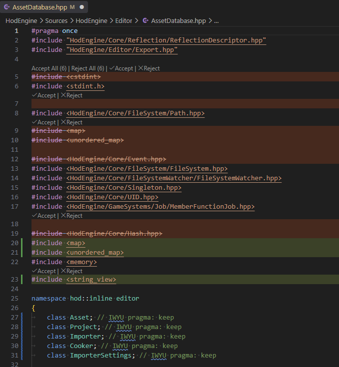

# Include What You Use (IWYU) for VS Code

This extension integrates the **Include-What-You-Use (IWYU)** tool directly into VS Code to help you maintain clean and optimized inclusions in your C/C++ projects. It analyzes your source files and suggests headers to add or remove, reducing compilation times and unnecessary dependencies.

## Features

* **Automatic Analysis**: Uses your `compile_commands.json` to analyze the active file with the correct compilation flags.
* **Dry Run**: Runs IWYU and displays header suggestions in a dedicated Output channel without modifying your files.
* **Fix Includes (Preview)**: Runs `fix_includes.py` in dry-run mode and shows the proposed changes directly in the editor — added lines highlighted, removed lines struck through — so you can accept or reject each change individually before anything touches disk.
* **Automatic Fix**: Directly applies header suggestions using the `fix_includes.py` script.
* **Folder-wide analysis**: Run Dry Run or Fix Includes across every file under a folder, right from the Explorer context menu.
* **Clang-cl & PCH Support**: Intelligently handles MSVC-specific flags (Clang-cl) and Precompiled Headers (PCH) to prevent breaking your build.
* **Live Reload**: Monitors changes to your compilation database and reloads the cache automatically.

## Requirements

To function properly, this extension requires:

1.  **IWYU present on your system**: The `include-what-you-use` executable must be available (either built manually, portable, or installed).
2.  **Compilation Database**: A `compile_commands.json` file generated by CMake, Meson, or another build tool.
3.  **Python**: Required if you wish to use the "Fix" or "Fix Includes (Preview)" functionality via the `fix_includes.py` script.

## Usage

### File-level commands

Run these from the Command Palette (`Ctrl+Shift+P`) while a C/C++ file is active:

1.  **IWYU: Dry Run**: Analyzes the current file and prints the report to the "Include What You Use" Output channel.
2.  **IWYU: Fix Includes**: Analyzes the file, pipes the report to the Python script, and applies the changes directly to disk.
3.  **IWYU: Fix Includes (Preview)**: Same analysis, but the suggested changes are inserted inline in the editor instead of being written to disk. Removed `#include` lines are struck through, added ones are highlighted, and an **Accept** / **Reject** CodeLens appears above each change (plus **Accept All** / **Reject All** when there's more than one). The file must be saved first, since IWYU only analyzes what's on disk.

### Folder-level commands

Right-click any folder in the **Explorer**, or run from the Command Palette (a folder picker will help you target the directory):

* **IWYU: Dry Run (Folder)**: Runs Dry Run on every file under the folder that has an entry in `compile_commands.json`.
* **IWYU: Fix Includes (Folder)**: Runs Fix Includes on every file under the folder and reports how many files were fixed vs. failed.

Both folder commands run in parallel (one worker per CPU core) with a cancellable progress notification.

## Extension Settings

This extension contributes the following settings through your `settings.json`:

### IWYU Core
* `iwyu.iwyu.path`: Path to the `include-what-you-use` executable (Default: `include-what-you-use`, resolved via your `PATH` if not absolute).
* `iwyu.iwyu.mappingFiles`: List of `.imp` mapping files to pass to IWYU.
* `iwyu.iwyu.additionalArgs`: Additional arguments to pass to the IWYU tool (e.g., `--verbose=3`).

### Compilation Database
* `iwyu.compileCommands.path`: Relative path to the folder (or file) containing `compile_commands.json` (Default: `build`).

### Fix Includes
* `iwyu.fixIncludes.path`: Path to the `fix_includes.py` script (Default: `fix_includes.py`).
* `iwyu.fixIncludes.additionalArgs`: Extra arguments for the fix script (e.g., `["--nosafe_headers"]`).

### Dry Run
* `iwyu.dryRun.openInNewFile`: When running Dry Run, also open the result in a new untitled text file/tab in addition to the Output channel (Default: `false`).

## Technical Notes

* **PCH Handling**: The extension automatically detects `/Yu`, `/Yc`, `/FI` or `-include` flags and adds the `--pch_in_code` argument to IWYU to ensure required precompiled header inclusions are preserved.
* **Driver Mode**: If `clang-cl` is detected as the compiler, the extension automatically sets the `--driver-mode=cl` flag.

## Known Limitations

* **IWYU is not perfect out of the box.** On a real codebase you will almost always need a `mapping.imp` file (see `iwyu.iwyu.mappingFiles`) tailored to your own headers and third-party libraries, plus `// IWYU pragma: keep` comments on lines IWYU would otherwise flag as removable — this is especially common for forward declarations (see the screenshot above: `class Asset; // IWYU pragma: keep`) and for headers that are only needed for their side effects. Expect to spend some time tuning these before the suggestions become trustworthy enough to accept blindly.
* **Commands need to run on a `.cpp` file with a compile command.** IWYU analyzes a single translation unit, so the extension needs an entry in `compile_commands.json` for the active file. In practice this means running the commands from a `.cpp` file (or another file that's directly compiled). Header-only files with no associated `.cpp` — a bare `config.h`, a template-only header, etc. — generally have no entry of their own in `compile_commands.json` and can't be analyzed directly this way; IWYU can still report changes for such a header when it's reached from *some* `.cpp`'s translation unit (which is why Fix Includes (Preview) can open more than one file), but there's no direct way to target it if nothing includes it.

---

## Release Notes

### 1.0.0

* Initial release.
* `compile_commands.json` support and file watching.
* `fix_includes.py` integration, including an in-editor **Fix Includes (Preview)** review flow.
* Folder-wide Dry Run and Fix Includes commands.
* Support for Clang-cl and PCH environments.

---

**Enjoy efficient header management!**
